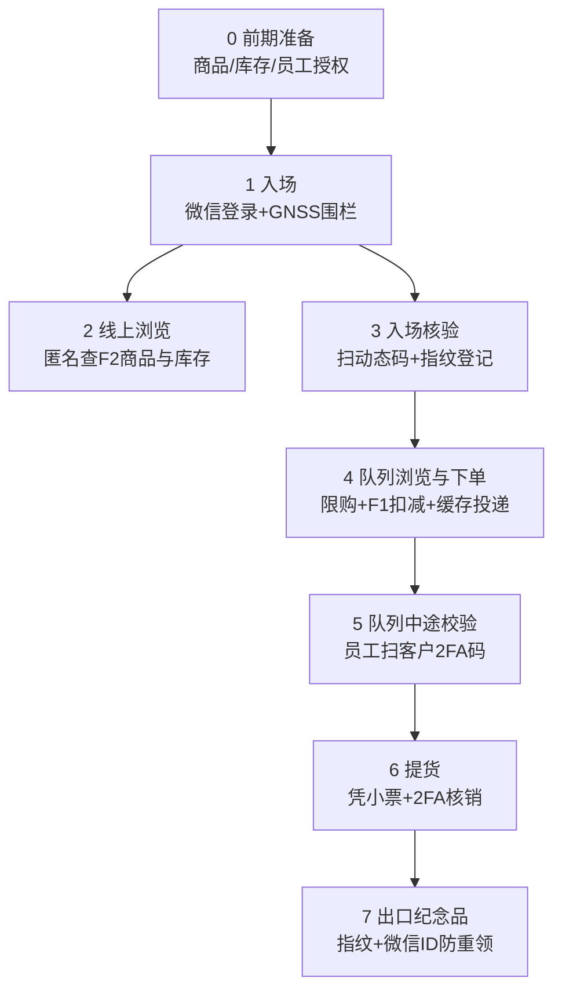

# 01 · 需求规格说明书（SRS）

> 文档版本 v1.0　|　依据：`prompt.txt` 原始需求 + 企业级细化
> 约定：FR = 功能需求编号；NFR = 非功能需求编号；优先级 P0=必须/P1=重要/P2=可选增强

---

## 1. 项目背景与目标

学校大型公益义卖活动「山海企划」面向全体大众，单场持续 3–5 小时，预计人流 3,000–5,000 人次。传统「现金/收款码 + 人工记账」模式在高并发下存在**排队过长、超卖、对账困难、提货错漏、纪念品重复领取**等痛点。

本项目构建一套 **下单—配货—库存一体化系统**，实现：

1. **入场可控**：位置围栏 + 动态二维码双因子入场，防场外下单、防黄牛批量进入；
2. **下单不超卖**：库存权威单点（F1）+ 限购校验 + 原子扣减；
3. **数据不丢**：订单「前1缓存 → 批量投递 → 后端落库」的可靠传输链路，断网重发；
4. **现场闭环**：订单实时推送到员工端并打印小票，凭 2FA 动态码完成队列校验、提货核销；
5. **权益防刷**：设备指纹 + 微信 ID 双标识，纪念品一人一份，重复领取自动拦截。

## 2. 项目范围

### 2.1 范围内（In Scope）

- 微信小程序（客户端 + 员工端双角色，同一小程序按权限区分）
- 两台云服务器应用（**全公网部署**）：前端聚合机 16C32G（F1+F2 双进程：交易/库存/目录/静态源站，库存同进程直读）+ BE 2C4G（账本/调度）
- **CDN 分流方案**（图片/静态边缘分发）与 DNS/域名/证书规划
- 现场接入组网方案（AP + QCI6 CPE，SIM 已办理）与部署文档
- 小票打印链路（BE → 员工端 → 热敏打印机）
- 纪念品发放台账
- 全套部署、压测、彩排、运维文档

### 2.2 范围外（Out of Scope）

- **支付**：义卖采用现场收款（现金/个人收款码由摊位自收），系统不做在线支付与退款流水（P0 决策，如需在线支付另立项目）
- 多场次/多会场复用的 SaaS 化改造
- 事后数据分析 BI 平台（仅提供导出 CSV 的原始数据）

## 3. 角色定义（Actor）

| 角色 | 载体 | 描述 |
|---|---|---|
| 顾客 Customer | 小程序·游客/微信登录 | 浏览商品、下单、出示 2FA 客户码、提货、领纪念品 |
| 员工 Staff | 小程序·员工身份（扫码激活） | 分区角色：入口 ENTRY / 队列 QUEUE / 提货 PICKUP / 纪念品 SOUVENIR / 机动 FLOAT / 管理员 ADMIN |
| 管理员 Admin | 小程序·ADMIN 角色 | 商品与库存初始化、员工授权码生成、全场监控大屏、应急开关 |
| 系统 System | F1/F2/BE | 自动校验、缓存、投递、推送 |

## 4. 业务流程（端到端 8 阶段）

### 4.0 阶段〇：前期准备（活动前）

| # | 需求 | 说明 |
|---|---|---|
| FR-0.1 (P0) | 商品信息录入（F2） | 管理员通过员工端 ADMIN 角色或导入 CSV 录入商品：名称、描述、价格、图片、限购数、状态；图片上传至 F2 静态目录 |
| FR-0.2 (P0) | 起始库存录入（F1） | 管理员按 SKU 录入起始库存；F1 加载后成为全场库存权威（SSOT），此后仅 F1 可变更库存 |
| FR-0.3 (P0) | 员工授权（BE） | 管理员为每位员工生成**专属一次性激活二维码**（含员工 ID + 一次性 token + 签名）；组织按员工 ID 完成实名绑定（姓名/部门/联系方式） |
| FR-0.4 (P0) | 员工端上线 | 员工用小程序扫激活码 → 提交实名 → BE 建档并签发长期令牌 → 员工端与 BE 建立 **WS 长连接**，分区角色生效 |
| FR-0.5 (P1) | 时钟预校准 | 全部服务器 NTP 对时；员工设备与客户端在入场时向 F1 取服务器时间计算偏移 |

### 4.1 阶段一：入场（登录 + 围栏）

| # | 需求 | 说明 |
|---|---|---|
| FR-1.1 (P0) | 微信登录 | `wx.login` 换取 openid 作为微信 ID（下称 wxid）；会话内缓存 |
| FR-1.2 (P0) | GNSS 围栏校验 | `wx.getLocation`（gcj02）获取坐标，与会场中心点计算球面距离，**≤ 800m（可配置）** 放行后续功能；连续 3 次获取失败给出引导（开定位/授权） |
| FR-1.3 (P1) | 围栏白名单 | ADMIN 可下发白名单 wxid 列表（嘉宾/媒体/测试），跳过围栏 |
| FR-1.4 (P0) | 隐私约束 | 坐标仅用于围栏判定，**不落库**；仅记录 pass/fail 与判定时间 |

### 4.2 阶段二：会场线上浏览（匿名）

| # | 需求 | 说明 |
|---|---|---|
| FR-2.1 (P0) | 匿名商品查询 | 未登录/未入场用户可匿名查询 F2：商品列表（分页）、详情、图片；**不开放下单入口** |
| FR-2.2 (P0) | 库存展示 | F2 向 F1 订阅库存（WS），转发给客户端；展示「剩余库存」，售罄商品置灰 |
| FR-2.3 (P1) | 匿名限流 | 匿名接口按 IP+设备指纹限流（如 30 req/min），防爬虫 |

### 4.3 阶段三：入口核验（排队入口，半离线）

| # | 需求 | 说明 |
|---|---|---|
| FR-3.1 (P0) | 入场动态码 | 入口大屏（平板/笔记本）展示动态二维码，payload = `入口ID + 时间戳 + HMAC 签名`，**每 2s 刷新** |
| FR-3.2 (P0) | 客户端离线校验 | 小程序内置入口密钥（随活动版本下发），扫码后**本地校验**签名与时间戳；扫描瞬间记录本地时间戳；**时间戳误差 >5s 判无效** |
| FR-3.3 (P0) | 设备指纹 | 校验通过后计算设备指纹（微信环境参数组合哈希，见 05 文档） |
| FR-3.4 (P0) | 上报登记 | 客户端将 `wxid + 设备指纹 + 入场码校验结果` 上报 F1；F1 若无该 wxid 记录则**返回通过并登记**（wxid、指纹、入口 ID、时间） |
| FR-3.5 (P0) | 客户 2FA 码生成 | 客户端按固定算法本地计算 2FA 客户码：`HMAC(密钥, wxid + 时间窗)`，**2s 刷新，>5s 时钟误差无效**；用于后续所有核验场景 |
| FR-3.6 (P1) | 入口异常处理 | 校验失败客户由入口员工半离线处理（人工放行/重试）；入口员工设备支持离线记录异常日志，恢复后补传 |

### 4.4 阶段四：队列中浏览与下单

| # | 需求 | 说明 |
|---|---|---|
| FR-4.1 (P0) | 队列中浏览 | 队列内可查看 F2 商品信息（优先用本地缓存）与实时库存 |
| FR-4.2 (P0) | 前端限购预校验 | 客户端按「每人每 SKU 限购 N 件」在提交前拦截超量 |
| FR-4.3 (P0) | 订单提交 | 订单提交至 F1：`wxid + 设备指纹 + 明细(SKU,数量)` |
| FR-4.4 (P0) | F1 三重校验 | ① wxid 已登记入场 ② 各 SKU 不超限购 ③ 库存充足 |
| FR-4.5 (P0) | 原子扣减 | 校验通过后 F1 **原子扣减库存**、将 wxid 标记「已下单」 |
| FR-4.6 (P0) | 订单缓存 | 订单先写入 F1 本地 WAL（先落盘再投递），进入待投递队列 |
| FR-4.7 (P0) | 批量投递 | F1 按固定间隔（默认 1s）或批量阈值（50 单）将缓存订单批量 HTTPS 推送 BE |
| FR-4.8 (P0) | 幂等落库 | BE 按订单号（ULID）幂等写入并返回「已写入」；F1 收到 ACK 后清除对应缓存 |
| FR-4.9 (P0) | 失败重发 | 超时/写入失败/BE 断连时，F1 **按顺序重发**未 ACK 订单直到成功（指数退避，上限 5s） |
| FR-4.10 (P0) | 订单推送与打印 | BE 落库后将订单推送到**对应员工端**（WS），员工端自动打印小票交予顾客 |
| FR-4.11 (P1) | 单人单订单 | 同一 wxid 活动期间仅允许 1 笔未完成订单（防占库存），可配置 |
| FR-4.12 (P2) | 订单取消 | ADMIN 角色可作废订单并回补库存（应急用，全程留痕） |

### 4.5 阶段五：队列中途校验

| # | 需求 | 说明 |
|---|---|---|
| FR-5.1 (P0) | 员工扫客户码 | 队列员工扫顾客出示的 2FA 客户码，本地验签+时间窗后解析出 wxid |
| FR-5.2 (P0) | 下单状态查询 | 员工端携员工令牌向 **F1** 查询该 wxid 是否已下单（下单时间、订单号脱敏） |
| FR-5.3 (P1) | 防代排检测 | 员工端同时显示「该指纹扫码次数」，异常频繁（>5 次/10min）标黄提示 |

### 4.6 阶段六：提货

| # | 需求 | 说明 |
|---|---|---|
| FR-6.1 (P0) | 凭小票提货 | 顾客按小票信息到提货区提取对应商品 |
| FR-6.2 (P0) | 提货核销 | 提货完成后员工扫顾客 2FA 码 → 校验通过 → 将订单标记 **FULFILLED**，并**释放该订单占用的所有缓存资源**（F1 侧「已下单」状态转为「已完成」，允许参与后续统计但不影响限购记录） |
| FR-6.3 (P0) | 防重复核销 | 同一订单二次核销返回「已核销」，员工端强提示 |
| FR-6.4 (P1) | 小票遗失兜底 | 顾客无法出示小票时，凭 2FA 码反查订单（员工端显示明细），管理员二次确认后放行并留痕 |

### 4.7 阶段七：出口纪念品

| # | 需求 | 说明 |
|---|---|---|
| FR-7.1 (P0) | 纪念品校验 | 出口员工扫顾客 2FA 码 → 解析 wxid + 指纹 → 查询 BE 台账 |
| FR-7.2 (P0) | 首次领取 | 无领取记录：员工端提示「未发放，已记录」，员工发放纪念品，BE 写入领取记录（wxid、指纹、员工、时间） |
| FR-7.3 (P0) | 重复拦截 | 有记录：提示「已发放，请勿重复领取」并标红，拒绝发放 |
| FR-7.4 (P1) | 台账对账 | 活动结束导出台账，与剩余纪念品实物盘点核对 |

### 4.8 阶段八：收尾

| # | 需求 | 说明 |
|---|---|---|
| FR-8.1 (P0) | 数据导出 | 导出订单、登记、纪念品台账 CSV（微信 ID 脱敏可选） |
| FR-8.2 (P1) | 现场监控大屏 | ADMIN 端实时展示：累计入场、订单数、各 SKU 剩余、投递队列积压、员工在线数 |
| FR-8.3 (P2) | 应急开关 | ADMIN 一键：暂停全场下单 / 恢复；清空匿名浏览限流 |

## 5. 设备分工（需求原文的工程化表述）

| 设备 | 职责清单 |
|---|---|
| 用户端（小程序·顾客） | 记录设备指纹；保存 wxid；展示商品信息；提供下单入口；生成并展示 2FA 客户码；离线校验入场动态码 |
| 前1（F1） | 缓存订单（WAL）；计算库存（SSOT）；登记 wxid 与设备指纹；队列校验查询；限购判定 |
| 前2（F2） | 存储商品图片/信息/前端资源；处理匿名商品查询；从 F1 获取库存并转发（WS 推送） |
| 后端（BE） | 存储订单（账本）；分发订单到员工端；分发任务；员工内部通信；纪念品台账；员工实名与鉴权 |
| 员工端（小程序·员工） | 获取/更新库存信息；接收配货信息并打印小票；队伍内校验；提货校验；纪念品发放；离线异常登记 |

## 6. 非功能需求（NFR）

### 6.1 性能（按 5,000 人上限设计）

| 编号 | 指标 | 目标值 | 依据 |
|---|---|---|---|
| NFR-P1 | 入场登记 TPS | 峰值 ≥ 20 TPS（1,500 人集中入场 5 分钟） | 5k × 40% 首小时入场 |
| NFR-P2 | 下单 TPS | 峰值 ≥ 20 TPS，持续 50 TPS 不降级 | 开场抢购场景 |
| NFR-P3 | 商品/库存读 QPS | F2 峰值 ≥ 500 QPS（缓存命中后源站 ≤ 50 QPS） | 5k 人轮询浏览 |
| NFR-P4 | 下单接口 P99 延迟 | ≤ 500ms（F1 端到端，不含打印） | 排队体验 |
| NFR-P5 | 订单投递延迟 | F1→BE 正常 ≤ 2s；断网恢复后 ≤ 30s 追平 | 打印及时性 |
| NFR-P6 | 库存推送延迟 | F1 变更 → 客户端可见 ≤ 3s | 防超卖体验 |
| NFR-P7 | 员工端订单推送延迟 | ≤ 1s（打印指令下发） | 配货节奏 |

### 6.2 可靠性

| 编号 | 指标 | 目标值 |
|---|---|---|
| NFR-R1 | 订单零丢失 | F1 WAL 先落盘；任何单点崩溃重启后未投递订单 100% 补投 |
| NFR-R2 | 幂等 | 同一订单重复投递/重复核销/重复领取，结果均幂等 |
| NFR-R3 | 活动时长可用性 | 4h 活动窗口内核心链路可用 ≥ 99.9%（≤ 25s 累计中断） |
| NFR-R4 | 降级 | BE 断连：F1 独立支撑下单+扣库存；入口断网：客户端离线校验+人工兜底 |

### 6.3 安全

| 编号 | 需求 |
|---|---|
| NFR-S1 | 全链路 TLS：客户/员工 ↔ F1/F2/BE 均 HTTPS/WSS；自签证书 + 小程序侧证书校验 |
| NFR-S2 | 2FA 密钥不入前端明文存储（混淆 + 活动一次性密钥，泄露影响限制在单场） |
| NFR-S3 | 匿名接口限流防爬；下单接口防重放（时间窗 + nonce） |
| NFR-S4 | 员工令牌按角色最小授权（ENTRY 不能核销提货等） |
| NFR-S5 | 坐标不落库；wxid 在导出报表中可脱敏；活动数据活动后 30 天内清理 |
| NFR-S6 | 员工激活码一次性 + 5 分钟过期，防员工码外泄 |

### 6.4 可运维性

| 编号 | 需求 |
|---|---|
| NFR-O1 | 单二进制部署：每个服务为单一静态编译 Rust 二进制 + 配置文件 |
| NFR-O2 | 结构化日志（JSON）+ 关键动作审计（登记/下单/核销/发放全留痕） |
| NFR-O3 | 健康检查端点 `/healthz`；监控大屏聚合展示 |
| NFR-O4 | 全套部署 SOP ≤ 2 小时完成现场搭建（含组网） |

### 6.5 兼容性

| 编号 | 需求 |
|---|---|
| NFR-C1 | 客户端：微信 ≥ 8.0，iOS/Android 主流机型；低端机（4GB RAM）可流畅浏览下单 |
| NFR-C2 | 员工端：支持安卓手机/平板；热敏打印机走蓝牙 SPP/BLE 或 USB |
| NFR-C3 | 弱网：现场 Wi-Fi 边缘区域（≤ 1Mbps）核心流程可用（请求合并 + 缓存） |

## 7. 关键约束

1. **微信小程序生态约束**：合法域名要求备案 + HTTPS——**云上公网部署 + 备案域名后天然满足**（原最大合规风险 R-01 已消除）；注意**备案周期 1–3 周，W1 立即启动**；
2. **GNSS 在室内精度差**（可能漂移 >100m），围栏阈值取 800m 并提供白名单兜底；
3. **公网暴露与出口带宽**：全部服务公网部署 → 需限流/防刷 + 云安全组最小暴露（仅 443）；图片/静态经 CDN 卸载后，现场出口仅承载 API（<5Mbps）；断出口时顾客可走自身蜂窝直连云端；
4. **2 人团队**：架构必须「简单可靠优先」，单二进制 + SQLite + 文件 WAL，禁止引入需要专职运维的中间件。

## 8. 验收标准（DoD 摘要）

| # | 验收项 | 通过标准 |
|---|---|---|
| AC-1 | 全流程演练 | 模拟 50 人全流程（入场→下单→校验→提货→纪念品）零差错 |
| AC-2 | 压测 | 20 TPS 下单持续 10min，P99 ≤ 500ms，订单 0 丢失 |
| AC-3 | 断网演练 | 拔 BE 网线 5min 期间下单正常，恢复后 ≤ 30s 全部补投并补打小票 |
| AC-4 | 时钟演练 | 客户端偏移 ±4s 内 2FA 互通；±6s 正确拒绝 |
| AC-5 | 防刷 | 同一 wxid 重复领纪念品 100% 拦截；超限购 100% 拒绝 |
| AC-6 | 彩排 | 现场全要素彩排 2 轮通过（见 07 文档彩排脚本） |
