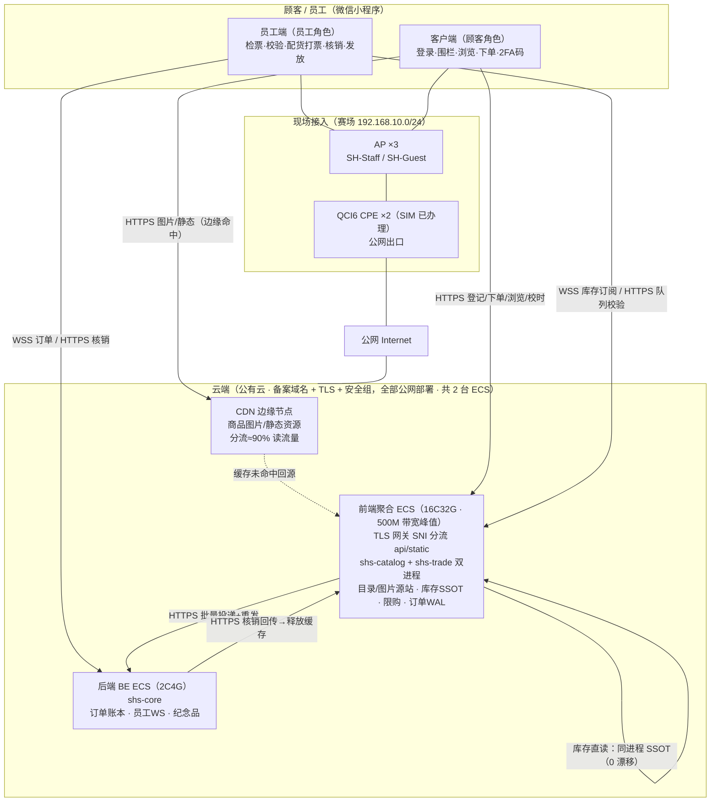
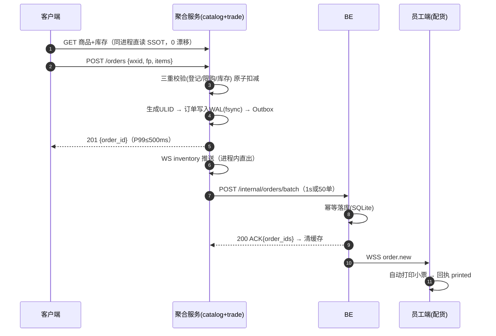
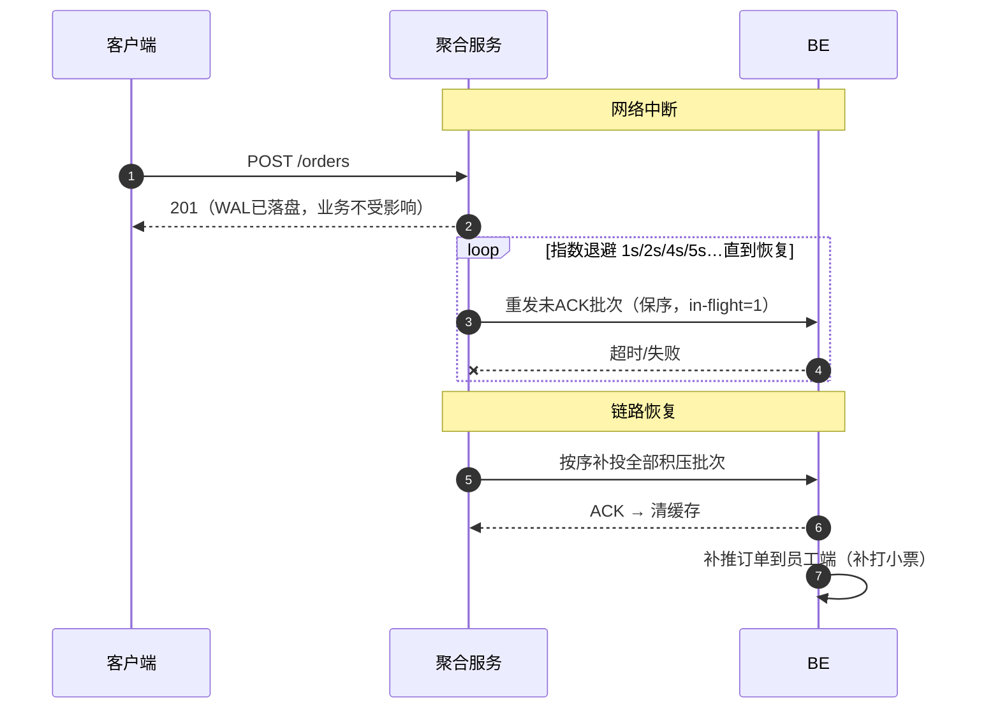
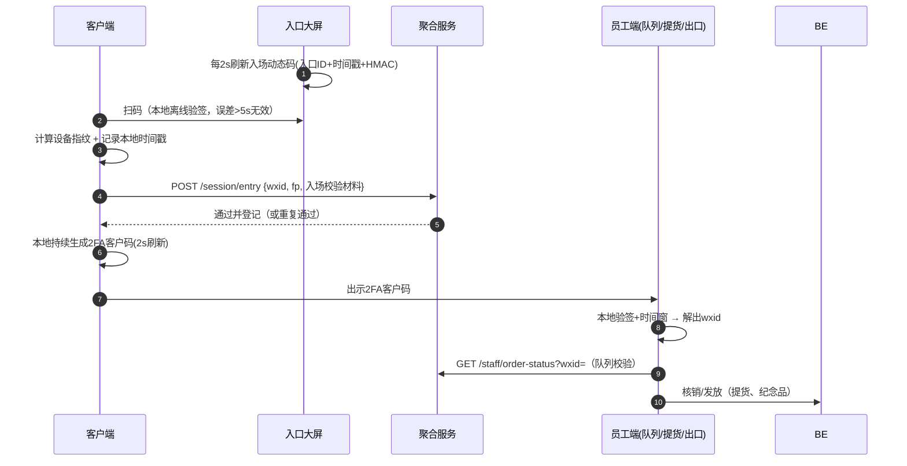
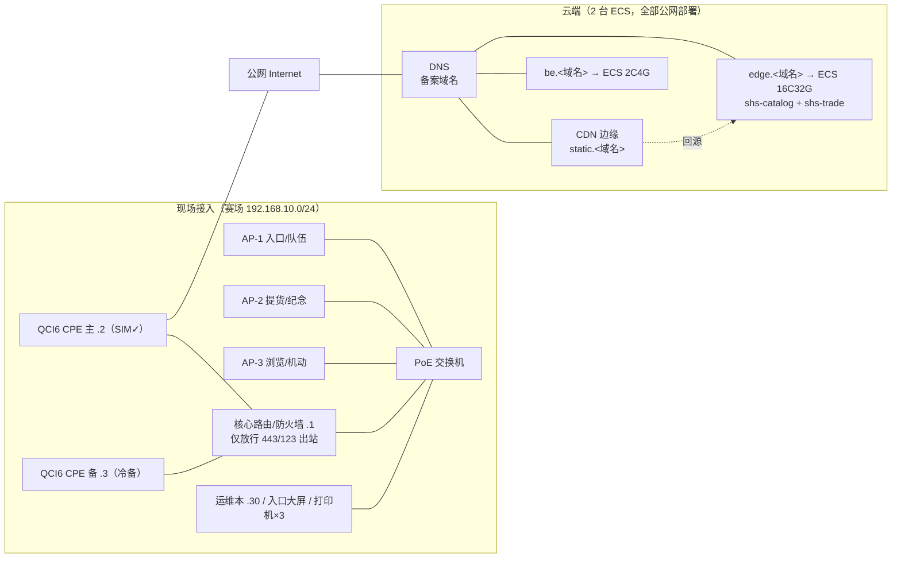

# 02 · 系统架构设计

> 文档版本 v1.2　|　v1.1：三服务迁移公有云、CDN 分流、SIM 已办理；v1.2：**论证并实施「用户态（F1+F2）合并为前端聚合单机（双进程）」**，全套降为 2 台 ECS
> 关联：01-需求规格说明书

---

## 1. 总体架构

> **合并论证摘要**（详见 §5.1）：目录与交易同进程后，客户端拉取库存**直读 SSOT 内存**（原 F1→F2 WS 推送链路整条删除，0 漂移）；双进程保留故障隔离；CDN 兜底浏览冗余。三个域名 `api / static / be .<备案域名>` 全部 443/TLS1.3 公网开放。

### 1.1 设计原则（2 人团队的取舍）

| 原则 | 落地 |
|---|---|
| 简单可靠优先 | 单二进制 ×3（聚合机上双进程）+ SQLite（WAL）+ Nginx/Caddy 网关；无消息队列/容器编排 |
| 单一职责 | 聚合机 = 面向用户的读+交易面（catalog/trade 双进程隔离）；BE = 账本与员工调度 |
| 全公网闭环 | 全链路 HTTPS/WSS（备案域名 + 免费证书）；**小程序合法域名校验天然满足（原 R-01 已消除）** |
| CDN 卸载 | 图片/静态边缘命中 ≈90% 读流量；现场出口仅承载 API（<5Mbps） |
| 故障域分界 | BE 挂 → 交易照常（WAL 兜底）；聚合机挂 → CDN 兜底浏览 + 云镜像 3min 重建；**现场出口断 → 顾客切蜂窝直连** |
| 幂等贯穿 | 订单号 ULID 全局唯一；投递、核销、领取全部幂等 |

## 2. 组件职责边界

### 2.1 CDN（边缘分流层）

- 承载商品图片与静态资源（`static.<域名>`），边缘命中 ≈90% 读流量；
- 源站为聚合机 static 路径；缓存未命中回源；图片 URL 版本化（`?v=hash`）避免缓存一致性 issue；
- **`/api/*` 一律不缓存**。

### 2.2 前端聚合服务（edge ECS，shs-catalog + shs-trade 双进程）

> 原 F1（交易）与 F2（目录）逻辑不变，仅部署合并。**对外接口路径与 03 文档完全一致**。

| 进程 | 职责 | 监听（经网关） |
|---|---|---|
| shs-catalog | 商品 CRUD/CSV 导入；图片源站（CDN 回源）；匿名商品 API（限流）；库存展示直读同进程 SSOT；员工库存 WS 推送 | `api.<域名>`（/products*、/ws/inventory、static 回源） |
| shs-trade | 入场登记（wxid+指纹+2FA 材料）；三重校验+原子扣减（16 分桶锁）；订单 ULID+WAL；批量投递 BE（单飞保序+退避重发）；员工队列校验查询；校时 `/time`；ADMIN 库存/应急开关 | `api.<域名>`（/session、/orders、/staff、/admin、/internal） |

- **库存拉取路径（合并核心收益）**：`GET /api/v1/products` 的 `stock` 字段直读 SSOT 内存 → 展示值=权威值，0 漂移；下单原子扣减与读在同一分桶锁域，超卖窗口仅剩网络往返；
- 进程间调用走 localhost；`X-Internal-Token` 保留（纵深防御）。

### 2.3 后端服务器 BE（shs-core，独立 ECS）——「账本与员工调度」

- 订单幂等落库（SQLite，ULID 主键）＝全场唯一事实；
- 员工实名建档、激活码签发校验、JWT 签发（分区角色授权）；
- 员工端 WS 长连接（心跳 15s、断线补发 last_seq、按区推送订单、45s 改派）；
- 提货核销 → 回调聚合机释放缓存资源；纪念品台账（wxid+指纹双唯一）；
- 监控大屏聚合、应急开关。

### 2.4 职责矩阵（R/A/C/I）

| 能力 | 客户端 | CDN | 聚合(catalog) | 聚合(trade) | BE | 员工端 |
|---|---|---|---|---|---|---|
| 登录/围栏 | R | – | – | A（校验登记） | – | – |
| 商品图片/静态 | R | **A（分发）** | R（源站） | – | – | – |
| 商品信息 API | R | – | **A** | – | – | R |
| 库存数值 | R（展示） | – | R（**同进程直读 SSOT**） | **A（权威）** | – | R |
| 限购判定/下单 | C / R | – | – | **A** | R（落库） | – |
| 打印小票 | – | – | – | – | **A（派单）** | R |
| 队列校验 | R（出示码） | – | – | **A（答复）** | – | R |
| 提货核销 | R | – | – | C（释放缓存） | **A（账本）** | R |
| 纪念品台账 | R | – | – | – | **A** | R |
| 员工鉴权 | – | – | C | C | **A（签发）** | R |

## 3. 关键数据流（时序）

### 3.1 下单主链路（最关键）

### 3.2 断网重发（BE 宕机/断连）

### 3.3 入场与 2FA 校验

## 4. 网络与域名规划（双区域）

### 4.1 域名与证书（主方案）

| 项 | 规划 |
|---|---|
| 域名 | 已备案域名一个，子域：`edge`（或 api）`/ be`（两台 ECS）；`static`（CDN CNAME，回源 edge） |
| 证书 | 云免费证书 / Let's Encrypt 自动续期；TLS1.3；网关按 SNI 分流 |
| 合规 | 备案域名 + HTTPS 使小程序合法域名校验天然通过（R-01 已消除）；**备案周期 1–3 周，W1 立即启动** |
| 服务间鉴权 | 聚合→BE 走 `be.<域名>` + `X-Internal-Token`（每场轮换）；同 VPC 可改内网地址（可选优化） |

### 4.2 IP 规划

| 区域 | 设备 | 地址 | 说明 |
|---|---|---|---|
| 云端 | ECS edge（16C32G，500M 带宽峰值按流量计费） | edge/static 源站 EIP；VPC 172.31.0.11 | 安全组仅 443 |
| | ECS be（2C4G） | be 域名 EIP；VPC 172.31.0.23 | 安全组仅 443 |
| 现场网段 | 核心路由/网关 | 192.168.10.1 | 仅出站 443/123 放行 |
| | QCI6 CPE 主/备 | .2 / .3 | SIM 已办理；备机冷备 ≤5min |
| | AP ×3 | .10–.12 | SH-Staff（隐藏，员工）/ SH-Guest（开放，顾客） |
| | 运维笔记本 | .30 | 监控大屏/管理 |
| | 员工/顾客 DHCP | .100–.149 / .150–.250 | 顾客段仅放行 443 出站 |

## 5. 容量估算与合并论证

### 5.1 用户态合并（F1+F2 → 单机）论证

| 维度 | 峰值负载（5,000 人上限） | 单 16C32G 承载力 | 余量 |
|---|---|---|---|
| API 读（JSON） | ~200 QPS | axum + 内存结构单核 5万+ QPS | >100× |
| 下单写 | 20–50 TPS | SQLite WAL 每秒数万事务；2FA HMAC 微秒级 | >100× |
| 内存（库存/登记常驻） | 5k wxid×200B ≈ 1MB + 200 SKU | 32GB | ≈千倍 |
| 图片磁盘 | 200 SKU × 200KB ≈ 40MB | 500G 盘 | ≈0.02% |
| 公网带宽 | CDN 卸载后仅 API：200QPS×1KB ≈ 1.6Mbps（×10 突发 16Mbps） | 500M 峰值（按流量计费，活动全程 <20GB） | >30× |

- **收益**：库存展示直读 SSOT（0 漂移）；链路少一跳（F1→F2 feed 删除）；省 1 台租费与一半运维面；
- **代价与缓解**：失去 F2 浏览冗余 → CDN 边缘缓存 + 客户端本地缓存兜底；整机故障 → 云镜像+数据盘 3min 重建（与原 F1 单点等价，未引入新交易单点）；
- **为何双进程**：catalog 崩溃/图片盘满不影响 trade；systemd 独立重启与滚动升级；
- **BE 为何独立**：员工 WS + 账本写入与顾客下单高峰同窗，分离是最后的故障域分界。

### 5.2 常规容量

| 维度 | 估算 | 结论 |
|---|---|---|
| 下单写入 | 峰值 20 TPS（设计 50） | SQLite WAL 充裕 |
| 订单投递 | 2,000–3,500 单/场，50 单/批 | <1MB/场 |
| WS 长连接 | 员工 10 + 大屏 2 | 忽略不计 |
| CDN 流量 | 出流量 ~60GB（命中率 90% 后） | 流量包 100GB 起 |

## 6. 技术选型

| 层 | 选型 | 理由 |
|---|---|---|
| 异步运行时 | tokio 1.x | 事实标准 |
| HTTP/WSS 框架 | axum 0.7 + tower | WS 支持好 |
| 数据库 | sqlx 0.8（SQLite，WAL） | 零运维；50 TPS 足够 |
| 网关 | Nginx/Caddy（SNI 分流 api/static，TLS 终结或透传） | 单 EIP 多域名 |
| 分发 | 云 CDN | 图片/静态卸载 |
| 日志/ID/序列化 | tracing(JSON) / ulid / serde | 结构化审计 |
| TLS | 云证书 + rustls | 自动续期 |
| 密码学 | hmac/sha2/ed25519-dalek | 2FA 与签名 |
| 前端 | 微信原生小程序 + TS | 扫码/定位/蓝牙打印 API 完整 |
| 部署 | 2 × 云 ECS + systemd | 免现场运维；快照/监控开箱即用 |

**否决备选**：现场物理服务器（运维/搬运/供电负担，且顾客蜂窝直连后无必要）；PostgreSQL/MySQL（SQLite 足够）；Kafka/Redis/容器编排（2 人无人力维护）；web-view 内嵌 H5（扫码/蓝牙受限）；三台分离（库存多一跳 + 多 1 台成本，容量论证不支撑）。

## 7. 部署视图与进程布局

| 节点 | 公网域名 | 进程 | 监听 | 数据/文件 | 备份 |
|---|---|---|---|---|---|
| ECS edge（16C32G） | `edge.<域名>`（api）+ static 源站 | Nginx/Caddy 网关 + shs-catalog + shs-trade | 443 → 127.0.0.1:8443/8444 | catalog.db、registry.db、outbox/*.wal、inventory.snapshot、/srv/static/ | 云盘快照 + 活动后归档 |
| ECS be（2C4G） | `be.<域名>` | shs-core | 443 | core.db（订单/员工/纪念品/审计） | 每 30min `VACUUM INTO` + 云快照 + U 盘离线副本 |

## 8. 高可用与降级矩阵

| 故障 | 影响 | 自动行为 | 人工预案 |
|---|---|---|---|
| BE 宕机 | 小票停打 | 聚合机照常下单扣库存，WAL 积压重发 | 云控制台重启；恢复后补打 |
| 聚合机 catalog 进程异常 | 图片/商品 API 慢或 502 | trade 进程不受影响，交易照常 | systemd 重启 catalog 进程 |
| 聚合机 trade 进程异常 | 不能下单 | catalog 展示正常（直读内存仍在） | systemd 重启 trade；WAL/快照恢复 |
| 聚合机整机故障 | 交易+API 全停 | – | 云镜像+数据盘 3min 重建；CDN 缓存兜底已加载页面 |
| F2 冗余消失（合并代价） | – | CDN 边缘缓存兜底浏览 | – |
| CDN 故障 | 图片慢 | 客户端回退直连 edge static 重试 | 控制台刷新/回退配置 |
| AP 单点 | 局部无 Wi-Fi | 顾客切自身蜂窝直连云 | 调整信道/功率 |
| CPE 出口断/拥塞 | 现场Wi-Fi上云慢 | 顾客蜂窝直连；员工终端切蜂窝 | 切备用 CPE（≤5min） |
| 打印机故障 | 单工位停 | 员工端重试队列 | 备用打印机；手写单号兜底 |
| 客户端时钟漂移 | 2FA 被拒 | 重新校时入口（公网可达） | 小票/订单号人工兜底 |

## 9. 安全架构总览

- **暴露面**：仅 443（edge + be 公网）+ CDN；云安全组白名单；SSH 仅密钥 + 来源 IP 限制；
- **认证**：顾客 = wxid + 设备指纹 + 2FA；员工 = 激活码换 JWT（分区角色 scope）；聚合→BE = `X-Internal-Token`（每场轮换）；
- **传输**：全链路 TLS1.3（备案域名证书）；
- **防刷**（公网部署，加固）：限流表（03 §7）+ 防重放 nonce + 云 DDoS 基础防护，必要时 WAF；
- **审计**：登记/下单/核销/发放全量 JSON 审计（05 威胁模型）。
