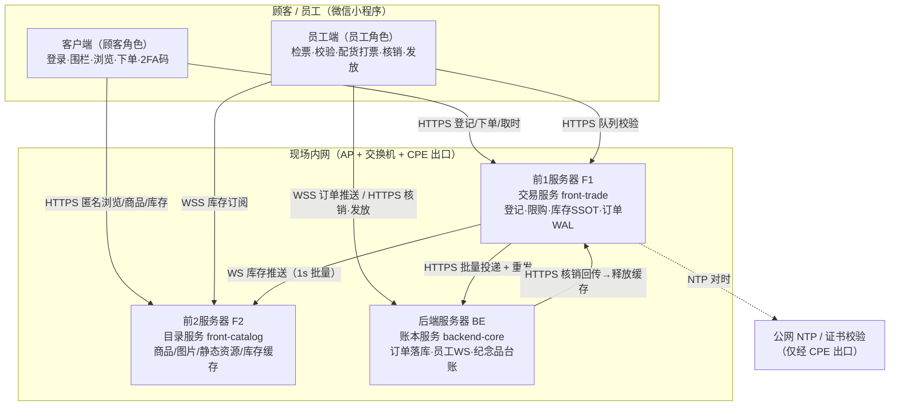
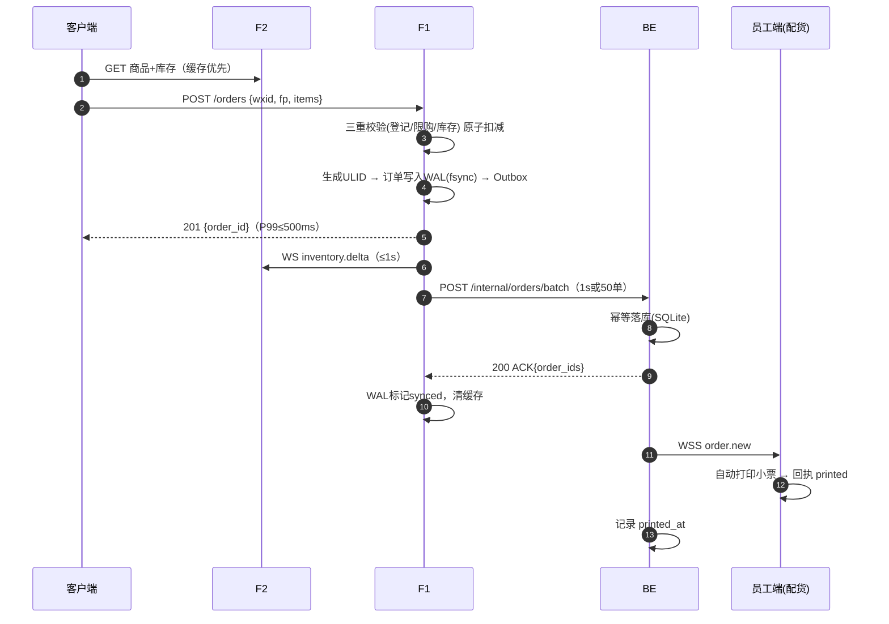
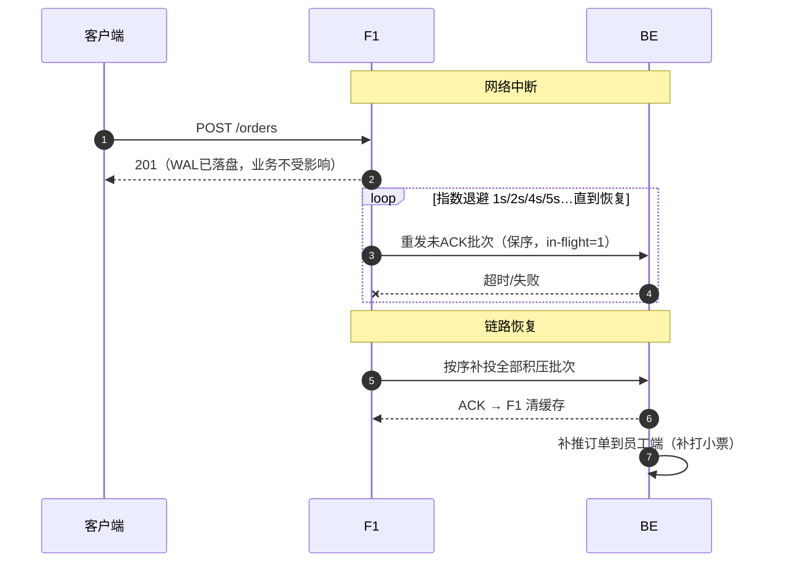
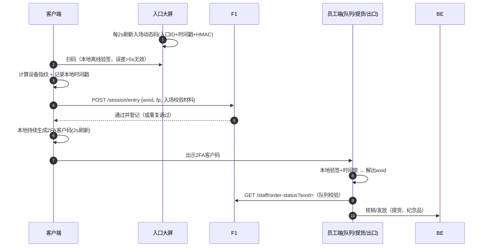
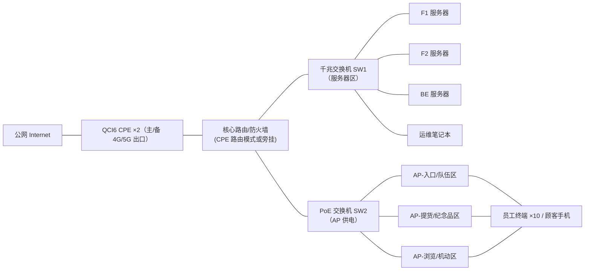

# 02 · 系统架构设计

> 文档版本 v1.0　|　关联：01-需求规格说明书

---

## 1. 总体架构

### 1.1 设计原则（2 人团队的取舍）

| 原则 | 落地 |
|---|---|
| 简单可靠优先 | 单二进制 Rust 服务 ×3；存储用 SQLite（WAL 模式）；无消息队列/无容器编排 |
| 单一职责 | F1 只管交易与库存，F2 只管目录与读流量，BE 只管账本与员工调度 |
| 内网自足 | 核心交易链路 100% 现场内网闭环；公网（CPE）仅 NTP/时间校准，出口抖动不影响交易 |
| 故障隔离 | BE 断连不阻塞下单（F1 缓存重发）；F2 宕机不影响交易（客户端用缓存 + F1 直接校验） |
| 幂等贯穿 | 订单号 ULID 全局唯一；投递、核销、领取全部幂等 |

## 2. 组件职责边界

### 2.1 前1服务器 F1（front-trade）——「交易与库存权威」

- **入场登记**：接收 `wxid + 设备指纹 + 入场校验结果`，登记去重，返回通过；
- **库存 SSOT**：内存库存表（`sku_id → available/sold/limit`）+ 原子扣减（`tokio::sync::Mutex` 分桶或无锁 CAS），定期快照落盘；
- **下单校验**：已登记？限购？库存？→ 三重校验通过后生成 ULID 订单号；
- **订单 WAL（Outbox）**：订单先落本地 WAL（append + fsync），再异步批量投递 BE；
- **可靠投递**：单飞（in-flight=1）保序批量 POST，ACK 后标记；断连指数退避重发；重启扫描 WAL 补投；
- **队列校验接口**：员工扫客户码后查询「该 wxid 是否已下单」；
- **时间服务**：`GET /api/v1/time` 供全端校钟；
- **对 F2 库存推送**：WS 推送全量快照（连接建立时）+ 增量（变更后 ≤1s 批量）。

### 2.2 前2服务器 F2（front-catalog）——「目录与读流量卸载」

- 商品 CRUD（ADMIN 录入/CSV 导入）、图片与静态资源存储（本地磁盘 + 内存 LRU 缓存）；
- 匿名商品/库存查询（带限流），**不校验登录**；
- 订阅 F1 库存 WS，本地维护库存只读副本并推送给员工端 WS；
- 提供前端静态资源（H5/图片），可开启 gzip/br。

### 2.3 后端服务器 BE（backend-core）——「账本与员工调度」

- 订单幂等落库（SQLite，按 ULID 去重），订单账本 = 全场唯一事实；
- 员工实名建档、激活码签发与校验、JWT 签发（按分区角色授权）；
- 员工端 WS 长连接管理（心跳 15s、断线感知、按区广播/单播订单）；
- 订单推送 → 员工端打印小票；打印回执（printed ack）回收；
- 提货核销（FULFILLED）→ 回调 F1 释放缓存资源；
- 纪念品台账（wxid+指纹 唯一约束）与出口核验接口；
- 全场监控数据聚合（大屏）与应急开关（暂停下单）。

### 2.4 职责矩阵（R/A/C/I）

| 能力 | 客户端 | F1 | F2 | BE | 员工端 |
|---|---|---|---|---|---|
| 登录/围栏 | R（执行） | A（校验登记） | – | – | – |
| 商品信息 | R（展示） | C | **A** | – | R |
| 库存数值 | R（展示） | **A（权威）** | R（缓存副本） | – | R |
| 限购判定 | C（预检） | **A** | – | – | – |
| 下单 | R（提交） | **A（受理+扣减+WAL）** | – | R（落库） | – |
| 打印小票 | – | – | – | **A（派单）** | R（打印） |
| 队列校验 | R（出示码） | **A（答复）** | – | – | R（扫码） |
| 提货核销 | R（出示码） | C（释放缓存） | – | **A（账本）** | R（扫码确认） |
| 纪念品台账 | R（出示码） | – | – | **A** | R（发放） |
| 员工鉴权 | – | C（验 JWT） | C（验 JWT） | **A（签发）** | R（持有） |

## 3. 关键数据流（时序）

### 3.1 下单主链路（最关键）

### 3.2 断网重发（BE 宕机/断连）

### 3.3 入场与 2FA 校验

## 4. 现场网络拓扑与 IP 规划

### 4.1 IP 规划（192.168.10.0/24）

| 设备 | IP | 说明 |
|---|---|---|
| 核心路由/网关 | 192.168.10.1 | 默认网关，仅放行 NTP(UDP/123)、DNS、证书 OCSP 出站 |
| QCI6 CPE 主 | 192.168.10.2 | 5G/4G 出口 |
| QCI6 CPE 备 | 192.168.10.3 | 冷备，手动切换 |
| AP ×3 | 192.168.10.10–12 | 管理 VLAN 同网段（现场规模小，不做多 VLAN，靠防火墙规则） |
| F1 | 192.168.10.21 | 443 (HTTPS/WSS) |
| F2 | 192.168.10.22 | 443 (HTTPS/WSS)，80→443 跳转 |
| BE | 192.168.10.23 | 443 (HTTPS/WSS) |
| 运维笔记本 | 192.168.10.30 | SSH/监控大屏/备份 |
| 员工终端 DHCP 池 | .100–.149 | 绑定 MAC 静态分配更佳 |
| 顾客 DHCP 池 | .150–.250 | 仅放行到 F1/F2 的 443（如开放浏览 Wi-Fi；默认顾客走自网流量） |

> 说明：顾客主要使用自身蜂窝网络访问公网侧入口（若采用），或连接现场开放 Wi-Fi。**两种模式在 08 文档有部署变体**；核心结论是：F1/F2/BE 的服务地址对顾客可达即可，交易不出内网。

### 4.2 域名与证书策略

| 方案 | 做法 | 适用 |
|---|---|---|
| **A. 内网域名 + 自签 CA（推荐）** | 现场 DNS（核心路由/运维机 dnsmasq）解析 `api.shanhai.local → F1/F2/BE`；现场签发自建 CA，员工/顾客端不强制校验或小程序以「调试模式」运行 | 现场封闭网 |
| B. 公网域名 + 备案 | 用已备案域名解析到内网（NAT/hosts），证书签发一次长期用 | 若小程序正式版无法关闭域名校验 |

> ⚠️ 合规关键点：**微信小程序正式版会校验 request 合法域名（须备案 + HTTPS）**。现场局域网直连方案必须提前 4 周用真机验证「开发版/体验版 + 调试模式」路径，并准备方案 B 兜底。详见 11-风险 R-01。

## 5. 容量估算（按 5,000 人上限 + 50% 余量）

| 维度 | 估算 | 结论 |
|---|---|---|
| 入场登记 | 5,000 人 × 40% 首小时 ≈ 2,000 次/h，峰值 2/s | 忽略不计 |
| 商品浏览读 | 5,000 人，人均 30 次请求，峰值集中 1h → 峰值 ~85 QPS，**打满 500 QPS 冗余** | F2 单机 + 缓存轻松承载 |
| 下单写入 | 峰值 20 TPS（设计目标 50） | SQLite WAL 每秒数万级事务能力，足够 |
| 订单批量投递 | 2,000–3,500 单/场，50 单/批 ≈ 70 批/场 | 带宽 <1MB |
| WS 长连接 | 员工 10 + F2 1 + 大屏 2 ≈ 13 条 | 忽略不计 |
| 静态资源 | 商品 200 SKU × 200KB 图 ≈ 40MB | 内网分发毫秒级 |
| SQLite 体积 | 订单 3,500 × 明细 ≈ 2MB + 日志 | 活动全程 <100MB |

**服务器选型结论**：三台均可用 4 核 8GB 迷你主机（如 N100/核显小主机）或借用的笔记本/台式机；F2 加一块 ≥500GB SSD 存图片（实际用量小）。无需机架服务器。详见 10-BOM。

## 6. 技术选型

### 6.1 后端（Rust 全家桶）

| 层 | 选型 | 理由 |
|---|---|---|
| 异步运行时 | tokio 1.x | 事实标准 |
| HTTP/WSS 框架 | axum 0.7 + tower | 与 tokio 生态契合，WS 支持好 |
| 数据库访问 | sqlx 0.8（SQLite，WAL 模式） | 编译期校验 SQL；SQLite 零运维，活动场景足够 |
| 序列化 | serde + serde_json | — |
| 日志 | tracing + tracing-subscriber(JSON) | 结构化审计 |
| TLS | rustls（自签 CA） | 纯 Rust，交叉编译友好 |
| WS 客户端 | tokio-tungstenite | F1→F2、内部推送 |
| 密码学 | hmac / sha2 / ed25519-dalek（RustCrypto） | 2FA 与签名 |
| ID | ulid crate | 有序、可读、URL 安全 |
| 配置 | figment 或 config + TOML | — |
| 错误 | thiserror + anyhow | — |
| 测试 | cargo test + mockito/wiremock | — |

### 6.2 前端（微信小程序）

| 层 | 选型 | 理由 |
|---|---|---|
| 框架 | **微信原生小程序**（WXML/WXSS/TS） | `wx.scanCode`/`wx.getLocation`/蓝牙打印 API 完整；需求写「H5」指页面形态——原生小程序渲染层即 WebView/H5 形态，能力最全。**否决 web-view 内嵌 H5**：扫码、定位、蓝牙打印受限制 |
| 状态 | 小程序 globalData + 轻量自研 store | 避免引入重框架 |
| 时间同步 | 入场时 `GET F1 /api/v1/time` 计算偏移缓存 | 2FA 精度 |
| 指纹 | `wx.getDeviceInfo/getSystemInfo` 等组合哈希 | 见 05 文档 |
| 打印 | 安卓 + 蓝牙热敏打印机（ESC/POS 指令） | 见 06 文档 |

### 6.3 否决的备选

| 备选 | 否决原因 |
|---|---|
| PostgreSQL/MySQL | 现场无人值守运维，SQLite WAL 已满足 50 TPS；减少 1 类故障面 |
| Kafka/Redis 等中间件 | 2 人团队无人力维护；F1 进程内队列 + WAL 足够 |
| 容器/K8s | 单二进制 + systemd 更简单，现场排障快 |
| web-view 内嵌 H5 | 扫码/定位/蓝牙桥接成本高、兼容性差 |

## 7. 部署视图与进程布局

| 服务器 | 进程 | 监听 | 数据/文件 |
|---|---|---|---|
| F1 (10.21) | `shs-trade` | 443 (TLS) | `/var/lib/shs/registry.db`、`outbox/*.wal`、`inventory.snapshot` |
| F2 (10.22) | `shs-catalog` | 443 (TLS) | `catalog.db`、`/srv/static/products/` |
| BE (10.23) | `shs-core` | 443 (TLS) | `core.db`（订单/员工/纪念品）、备份 U 盘挂载点 |
| 全部 | systemd unit + 自动重启 | — | `/etc/shs/*.toml`、journald JSON 日志 |

## 8. 高可用与降级矩阵

| 故障 | 影响 | 自动行为 | 人工预案 |
|---|---|---|---|
| BE 宕机 | 小票停打 | F1 照常下单扣库存，WAL 积压重发 | 重启 BE；恢复后补打 |
| F1 宕机 | 不能下单 | — | systemd 秒级重启；重启扫描 WAL 补投；库存从快照恢复（差量由 BE 反对账） |
| F2 宕机 | 不能浏览新图/库存不刷新 | 客户端用本地缓存；下单不受影响 | 重启 F2 |
| AP 单点 | 局部无 Wi-Fi | 客户端切蜂窝/其他 AP | 调整 AP 信道/功率 |
| CPE 出口断 | 无 NTP/校时 | 已校钟客户端 2FA 正常（本地算法） | 切备用 CPE；2FA 容差 ±5s 内影响可控 |
| 打印机故障 | 单工位停 | 员工端重试队列 | 备用打印机；或手写小票号（兜底流程见 08） |
| 某客户端时钟漂移 | 2FA 被拒 | 员工端提示重新校时入口 | 手动核对小票/订单号兜底 |

## 9. 安全架构总览

- **边界**：核心路由防火墙仅放行必需端口；服务器间互访最小化（F2 不可达 BE 等）；
- **认证**：顾客 = wxid + 设备指纹 + 2FA；员工 = 激活码换 JWT（含角色分区声明，2h 有效自动续期）；
- **授权**：JWT scope 按 ENTRY/QUEUE/PICKUP/SOUVENIR/ADMIN 精确控制 API；
- **传输**：全链路 TLS1.3（rustls）；
- **防重放**：写操作带 `window + nonce`，服务端 5s 窗口去重；
- **审计**：登记/下单/核销/发放/异常全量 JSON 审计日志（详见 05 威胁模型）。
