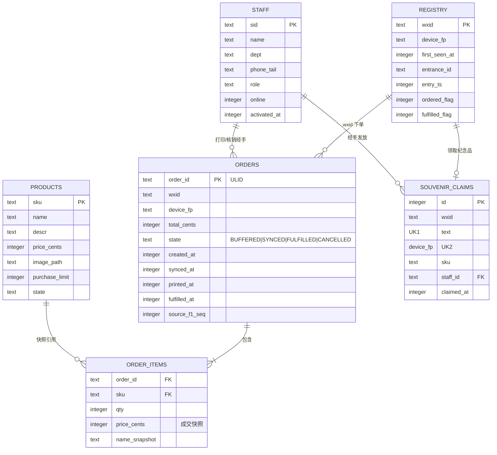
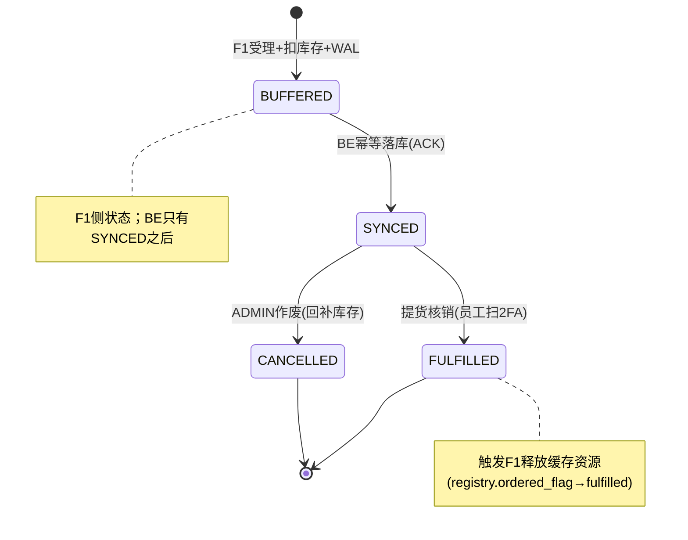

# 04 · 数据模型设计

> 文档版本 v1.0　|　存储选型：三服务均为 SQLite（WAL 模式）+ 文件系统；F1 库存主存于内存、快照落盘
> 命名约定：表名小写下划线；主键 `id`；金额单位分（INTEGER）；时间戳毫秒（INTEGER）

---

## 1. 数据所有权总览（谁的库谁是权威）

| 数据 | 权威存储 | 副本/派生 | 说明 |
|---|---|---|---|
| 商品目录/图片 | 聚合机 `catalog.db`（catalog 进程） | CDN 边缘缓存；客户端缓存 | catalog 是商品唯一写入口 |
| 实时库存 | 聚合机内存表 + 快照文件（trade 进程，**同机**） | catalog 进程同机直读（0 漂移）；BE 期末对账 | **唯一可写点在 trade** |
| 用户登记（wxid+指纹） | 聚合机 `registry.db` | BE 导出汇总 | — |
| Outbox 订单队列 | 聚合机 `outbox/*.wal`（JSONL） | — | 投递 ACK 后归档 |
| 订单账本 | BE `core.db.orders` | 聚合机缓存（短期） | 全场唯一事实 |
| 员工/实名/JWT | BE `core.db.staff` | — | — |
| 纪念品台账 | BE `core.db.souvenir_claims` | — | 唯一约束防重领 |
| 审计日志 | 各服务 JSON 日志 + BE `audit_log` | — | — |

## 2. ER 图（跨服务逻辑视图）



## 3. F1 数据模型（registry.db + 内存库存 + WAL）

### 3.1 表结构 DDL

```sql
PRAGMA journal_mode = WAL;
PRAGMA synchronous  = NORMAL;

-- 用户登记表
CREATE TABLE registry (
    wxid          TEXT PRIMARY KEY,          -- openid
    device_fp     TEXT NOT NULL,
    first_seen_at INTEGER NOT NULL,          -- ms
    entrance_id   TEXT NOT NULL,             -- EN1..ENn
    entry_ts      INTEGER NOT NULL,          -- 扫码瞬间客户端时间
    ordered_flag  INTEGER NOT NULL DEFAULT 0,-- 已下单（限购占用）
    fulfilled_flag INTEGER NOT NULL DEFAULT 0,
    fp_alert      INTEGER NOT NULL DEFAULT 0 -- 指纹风控告警
);
CREATE INDEX idx_registry_fp ON registry(device_fp);

-- Outbox 索引表（WAL 为 JSONL 文件，此表是内存队列的持久化索引，便于断点续投）
CREATE TABLE outbox (
    order_id   TEXT PRIMARY KEY,
    wal_file   TEXT NOT NULL,
    wal_offset INTEGER NOT NULL,
    state      TEXT NOT NULL DEFAULT 'PENDING',  -- PENDING|INFLIGHT|SYNCED
    attempts   INTEGER NOT NULL DEFAULT 0,
    created_at INTEGER NOT NULL
);
CREATE INDEX idx_outbox_state ON outbox(state);
```

### 3.2 内存库存结构（权威）

```rust
struct Inventory {
    map: DashMap<Sku, Slot>,          // 并发分桶
}
struct Slot {
    available: i64,                   // 可售
    sold: i64,                        // 已售（含未提货）
    limit: i64,                       // 每人限购
}
// 扣减伪代码（单 SKU 原子）：
// map.entry(sku).and_modify(|s| {
//     ensure s.available >= qty else Err(STOCK_INSUFFICIENT);
//     s.available -= qty; s.sold += qty;
// })
// 事务性：一笔订单跨多 SKU 时先全部预检，再逐桶扣减；失败回补已扣桶（补偿法）
```

- 快照：每 30s + 优雅停机时写 `inventory.snapshot`（JSON）；启动加载快照，再按 BE 侧已同步订单对账补差（期末一致性由 BE 对账保证）；
- 库存消费：catalog 与 trade 同机，商品接口**直读同进程 SSOT**；员工端 WS 由 catalog/trade 直出；原跨机 `inv_version` 乱序保护随 F1→F2 推送链路取消。

### 3.3 WAL 文件格式（outbox/`YYYYMMDD.wal`）

```json
{"order_id":"01J9ZK3W8X...","payload":{...订单全量...},"ts":1788000000123}
```

- append + `fdatasync`；SYNCED 后每日归档压缩；重启时从 `outbox` 表定位未 SYNCED 订单重投。

## 4. BE 数据模型（core.db）

### 4.1 DDL

```sql
PRAGMA journal_mode = WAL;

CREATE TABLE orders (
    order_id      TEXT PRIMARY KEY,          -- ULID，幂等键
    wxid          TEXT NOT NULL,
    device_fp     TEXT NOT NULL,
    total_cents   INTEGER NOT NULL,
    state         TEXT NOT NULL,             -- SYNCED|FULFILLED|CANCELLED（落库即 SYNCED）
    source_f1_seq INTEGER NOT NULL,
    created_at    INTEGER NOT NULL,
    synced_at     INTEGER NOT NULL,
    printed_at    INTEGER,
    printed_by    TEXT,
    fulfilled_at  INTEGER,
    fulfilled_by  TEXT
);
CREATE INDEX idx_orders_wxid ON orders(wxid);
CREATE INDEX idx_orders_state ON orders(state);

CREATE TABLE order_items (
    order_id      TEXT NOT NULL REFERENCES orders(order_id),
    sku           TEXT NOT NULL,
    name_snapshot TEXT NOT NULL,
    qty           INTEGER NOT NULL,
    price_cents   INTEGER NOT NULL,
    PRIMARY KEY (order_id, sku)
);

CREATE TABLE staff (
    sid          TEXT PRIMARY KEY,           -- STF0007
    name         TEXT NOT NULL,
    dept         TEXT,
    phone_tail   TEXT,
    role         TEXT NOT NULL,              -- ENTRY|QUEUE|PICKUP|SOUVENIR|FLOAT|ADMIN
    activate_tok TEXT,                       -- 未用一次性token；用后置NULL
    activated_at INTEGER,
    last_seen_at INTEGER
);

CREATE TABLE souvenir_claims (
    id          INTEGER PRIMARY KEY AUTOINCREMENT,
    wxid        TEXT NOT NULL UNIQUE,        -- 防重领第一道
    device_fp   TEXT NOT NULL,
    sku         TEXT NOT NULL,
    staff_id    TEXT NOT NULL,
    claimed_at  INTEGER NOT NULL
);

CREATE TABLE audit_log (
    id         INTEGER PRIMARY KEY AUTOINCREMENT,
    actor      TEXT NOT NULL,                -- sid / wxid / system
    action     TEXT NOT NULL,                -- ORDER_CREATE/PICKUP/CLAIM/ADJUST/PANIC...
    detail     TEXT NOT NULL,                -- JSON
    ts         INTEGER NOT NULL
);
CREATE INDEX idx_audit_action ON audit_log(action, ts);

CREATE TABLE tasks (
    task_id   TEXT PRIMARY KEY,
    zone      TEXT NOT NULL,
    text      TEXT NOT NULL,
    state     TEXT NOT NULL DEFAULT 'OPEN',  -- OPEN|DONE
    created_by TEXT, created_at INTEGER, done_at INTEGER
);
```

### 4.2 订单状态机



> 侧态（不走状态机）：`printed`（BE 记录打印回执）、`outbox.state`（PENDING/INFLIGHT/SYNCED，投递通道状态）。

### 4.3 幂等与对账

| 场景 | 机制 |
|---|---|
| 批量投递重复 | `orders.order_id` 主键冲突 → `INSERT OR IGNORE`，ACK 返回 `existed=true` |
| 核销重复 | `fulfilled_at` 非空即拒绝（409） |
| 纪念品重复 | `wxid UNIQUE` + `device_fp UNIQUE` 双约束（一个换微信设备也不行） |
| 期末对账 | 活动结束：BE 导出全量订单 → 对照 F1 快照（sold 总数）与实物盘点；差异输出 CSV |

## 5. F2 数据模型（catalog.db）

```sql
CREATE TABLE products (
    sku            TEXT PRIMARY KEY,        -- SKU008
    name           TEXT NOT NULL,
    descr          TEXT,
    price_cents    INTEGER NOT NULL,
    image_path     TEXT,                    -- /static/products/sku008.webp
    purchase_limit INTEGER NOT NULL DEFAULT 1,
    state          TEXT NOT NULL DEFAULT 'ON_SALE',  -- ON_SALE|HIDDEN
    sort_no        INTEGER NOT NULL DEFAULT 0,
    updated_at     INTEGER NOT NULL
);

-- stock_replica 表已随 F1→F2 推送链路删除：
-- catalog 与 trade 同机双进程，库存展示直读 trade 进程内 SSOT（共享内存态/IPC），
-- 无需副本表与乱序保护。
```

**静态资源布局**：

```
/srv/shs/static/
├── products/        # sku008.webp ...（服务端统一转 webp，≤200KB）
└── app/             # 前端资源（如活动 H5 物料、指引图）
```

## 6. 关键查询（性能敏感路径）

| 查询 | 位置 | 方案 |
|---|---|---|
| 库存读（匿名 500 QPS） | 聚合机 catalog | 同进程直读 SSOT 内存（DashMap），无磁盘读 |
| 下单限购校验 | F1 | `SELECT ordered_flag/Σqty FROM registry/orders` 内存化：F1 持有 `wxid → 已购数量` HashMap，启动时从 WAL+快照重建 |
| 员工查下单状态 | F1 | registry 主键点查（内存索引） |
| 大屏聚合 | BE | 预聚合内存计数器 + 5s 刷新，不实时 SUM |

## 7. 数据生命周期与备份

| 数据 | 活动 4h 内 | 活动后 |
|---|---|---|
| F1 WAL/快照 | 持续写 | 云盘快照 + 归档至运维笔记本 + U 盘，保留 30 天后删除 |
| BE core.db | 持续写；每 30min `VACUUM INTO` 到备份目录 | 活动结束全量导出 CSV + db 快照三介质（云对象存储 / 运维本 / U 盘）；30 天后按 NFR-S5 清理 |
| F2 目录 | 持续读（图片经 CDN 分发） | 保留至下届复用或归档 |
| 审计日志 | journald | 随云盘快照归档 30 天 |
