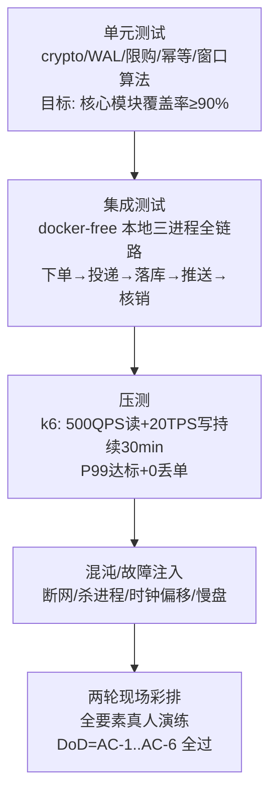

# 07 · 测试与压测计划

> 文档版本 v1.0　|　策略：测试金字塔 + 活动彩排（现场演练是本项目最高优先级测试）
> 工具：cargo test / nextest、wiremock、k6、安卓真机 ×2、彩排全要素

---

## 1. 测试策略总览



## 2. 单元测试（Rust，cargo nextest）

| 模块 | 必测用例（节选） | 覆盖目标 |
|---|---|---|
| shs-crypto（2FA） | 金样本 128 组（Rust/TS 双端一致）；边界窗 ±0/2/4/5/6s；恒定时间比较 | 100% |
| outbox | 落盘 fsync；重启续投；ACK 半批；乱序批拒绝 | ≥90% |
| inventory | 原子扣减并发（1000 线程争 1 件）；多 SKU 回补；限购累计 | ≥90% |
| 幂等 | 同 order_id 重复落库 existed=true；nonce 重放 | 100% |
| registry | 重复登记 first_time=false；指纹告警阈值 | ≥85% |
| JWT/授权 | 角色越权矩阵（03 §1.2 × 06 §1.3 全组合） | 100% |

## 3. 集成测试（本地三服务全链路）

环境：一台开发机跑 `shs-trade` + `shs-catalog` + `shs-core`（localhost 三端口）+ 真机小程序连开发机热点。

### 3.1 用例矩阵（节选）

| ID | 场景 | 步骤要点 | 断言 |
|---|---|---|---|
| IT-01 | 下单正向 | 登记→下单 2 SKU | 201；库存减；WAL 落盘；≤2s 落 BE；员工端收单 |
| IT-02 | 限购 | 限 2 件连买 3 件 | 第二笔 409 LIMIT_EXCEEDED |
| IT-03 | 超卖 | 库存 1，两客户端并发下单 | 恰 1 成功 1 失败 |
| IT-04 | 幂等投递 | 同批重发 ×3 | BE 仅 1 单；ACK 正常；F1 清缓存 |
| IT-05 | BE 断连 5min | 断网期间持续下单 | F1 全部 201；恢复后 ≤30s 全部落库；员工端补收打印 |
| IT-06 | F1 重启 | 下单→杀进程→重启 | 库存/registry 恢复正确；未 SYNCED 补投 |
| IT-07 | 2FA 互通 | 客户端生成→员工端扫 | ±4s 通过 / ±6s 拒绝（真机对表） |
| IT-08 | 入场动态码 | 大屏 2s 刷新 | 5s 内扫通过；人为 +6s 拒绝 |
| IT-09 | 纪念品防重 | 同 wxid 两次领取 | 第二次 409 ALREADY_CLAIMED |
| IT-10 | 换设备/换号防重 | 同指纹新 wxid、同 wxid 新指纹 | 均 409（双唯一约束） |
| IT-11 | 核销幂等 | 同订单两次核销 | 第二次 409；F1 缓存资源已释放 |
| IT-12 | 围栏 | 模拟坐标 >800m | 403 GEOFENCE_FAIL；白名单放行 |
| IT-13 | 打印链路 | 真机+蓝牙打印机 | 自动打印内容正确；回执落库 printed_at |
| IT-14 | 应急开关 | ADMIN pause | 新单 503 引导语；恢复后正常 |

## 4. 压测（k6）

### 4.1 模型（对应 NFR-P1..P7）

```javascript
// 场景 A：浏览读压（F2）
// 500 VU，商品列表+详情混刷，命中缓存断言 QPS≥500、P99≤200ms
// 场景 B：交易写压（F1）
// 峰值阶跃：5→20→50 TPS 各 5min；每虚拟用户独立 wxid 池（预生成 5000 登记）
// 断言：P99≤500ms；错误率<0.1%；订单数 == 下单成功数（0丢单）
// 场景 C：断网恢复追平
// 写压 20TPS 持续 5min 中途拔 BE 网线 2min → 恢复
// 断言：恢复后 ≤30s backlog 归零；账本订单数一致
// 场景 D：库存推送风暴
// ADMIN 连续 adjust 100 SKU × 10轮 → F2 副本 ≤3s 收敛，员工端 WS 无积压
```

### 4.2 通过标准

| 项 | 标准 |
|---|---|
| 读 P99 | ≤200ms（F2 缓存命中） |
| 写 P99 | ≤500ms（F1 受理） |
| 0 丢单 | BE 账本数 = F1 受理数 = 客户端成功响应数 |
| 资源 | 单机 CPU ≤60%、内存 ≤1GB（留 40% 现场余量） |

## 5. 混沌/故障注入清单

| ID | 注入 | 期望 |
|---|---|---|
| CH-01 | BE kill -9 运行中 | F1 照常受理；BE 重启补投成功 |
| CH-02 | F1 kill -9 | systemd 拉起 ≤3s；库存/登记恢复；无重复扣减 |
| CH-03 | F2 断网 10min | 客户端缓存浏览；下单不受影响 |
| CH-04 | 交换机断电（全断） | 客户端报网络错误不白屏；恢复后 pending_entry 重放 |
| CH-05 | 时钟偏移注入（客户端 +6s） | 2FA 拒绝 + 引导重校；重校后恢复 |
| CH-06 | NTP 源全断（服务器） | 服务器本地时钟漂移 ≤ 活动时长容差；2FA 服务端复核容错 |
| CH-07 | 打印机断电 | 员工端报错+手动补打；BE 改派逻辑触发 |
| CH-08 | SQLite 盘满模拟（小分区） | 明确报错不静默丢数据；Runbook 清理步骤生效 |

## 6. 现场彩排（最高优先级）

### 6.1 彩排一（T-2 周，场地可用部分区域）

- 人员：2 开发 + 6 志愿者扮演顾客/员工；
- 范围：现场接入组网（AP+CPE）+ 云端全链路（50 单）+ CDN 命中验证 + 打印 + 纪念品；**蜂窝直连抽查（移动/联通/电信各 1 台真机关 Wi-Fi 全流程）**；
- 产出：问题清单（网络覆盖热力、打印速度、围栏阈值实测）。

### 6.2 彩排二（T-1 周，全要素）

- 全员参与：员工按活动日岗位就位，志愿者 ≥20 人 + 教师/学生自然人流；
- 注入 2 个演练故障（BE 断网 3min / 一台打印机下线）；
- 测量：单客入场核验耗时 ≤20s；下单→小票 ≤30s；提货核销 ≤15s；
- 通过：AC-1..AC-6 全绿（01 §8）。

### 6.3 活动日晨检（Checklist 摘要）

```
□ 三服务 healthz（公网域名 edge/be）全绿；NTP 偏移 <100ms；CDN 命中抽查
□ 库存初始化复核（双人对账：系统数=实物数）
□ 员工全员激活在线；角色与岗位一致
□ 入口大屏动态码刷新；真机扫通
□ 打印机 ×3 试打；备纸到位
□ CPE 出口可用（SIM 已办理）；备用 CPE 待命；蜂窝直连抽查 3 家运营商
□ 大屏监控页面投屏
□ 2 台调试真机（超管权限）待命
```

## 7. 缺陷管理约定

- 严重级：S0=丢单/超卖/重复领取 → 活动前必须修复；S1=功能不可用但有兜底 → 彩排二前修复；S2=体验缺陷 → 活动前评估；
- 所有 S0/S1 缺陷修复必须回补对应层测试用例；
- 冻结期（T-3 天起）：仅允许 S0 修复，改动需双人复核。
