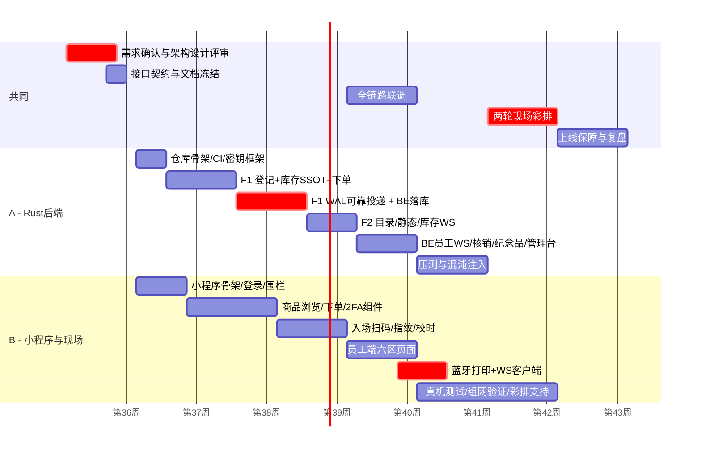

# 09 · 项目排期与人力计划

> 文档版本 v1.0　|　约束：**2 人团队、全功能不裁剪、最高效率执行**；总工期 8 周（56 自然日），关键路径为「Rust 三服务链路」
> 分工：**A = Rust 后端**（F1/F2/BE + 密码学 + 投递）；**B = 小程序端 + 现场系统**（客户端/员工端 + 蓝牙打印 + 组网）。设计评审、联调、压测、彩排共同参与。

---

## 1. 里程碑总览

| 里程碑 | 时间 | 判定（SMART DoD） |
|---|---|---|
| M1 架构与契约冻结 | W1 末 | 02/03/04/05 文档评审通过；仓库骨架 + CI 绿；2FA 金样本双端一致（128/128） |
| M2 交易主链路打通 | W3 末 | 真机下单→WAL→BE 落库→WS 推员工端（curl 模拟打印）≤2s；库存并发压测 50TPS 0 超卖 |
| M3 全功能联通 | W5 末 | 06 全页面可用；入场动态码/2FA/打印/纪念品/管理台真机全链路；IT-01..IT-14 全过 |
| M4 性能与稳定性达标 | W6 末 | k6 场景 A–D 全过（NFR-P1..P7）；混沌 CH-01..08 演练完成 |
| M5 彩排通过 | W7 末 | 彩排一、二完成；AC-1..AC-6 全绿；BOM 物料到位 |
| M6 上线与复盘 | W8 | 活动日全绿运行；数据三备份；复盘会 + 归档 |

## 2. 甘特图（周粒度，○=主责 △=协从）

## 3. 双周迭代计划（任务分解到人·天）

### W1（M1）：设计冻结

| 天 | A（Rust） | B（端+现场） |
|---|---|---|
| D1-D2 | 需求走查；架构评审；02/03 文档定稿 | 同左（端视角评审接口契约） |
| D3 | 仓库 monorepo 骨架 + CI（fmt/clippy/test） | 小程序工程骨架 + FSD 目录 + 主题 |
| D4 | `shs-crypto` crate：HMAC/窗口/金样本 | TS 侧 hmac 实现 + 与 Rust 金样本对齐 |
| D5 | 密钥/配置框架（TOML+注入）；部署脚本初版 | 真机扫码/定位能力 spike（风险提前爆） |

### W2（交易核心）

| 天 | A | B |
|---|---|---|
| D1-D3 | F1：registry + 围栏材料复核 + `/time` + `/session/entry` | 登录/围栏页 + 校时模块 |
| D4-D5 | F1：内存库存 + 原子扣减 + 限购 + `/orders` | 商品列表/详情 + 匿名缓存策略 |
| D6-D7 | F1：Outbox WAL（fsync/重启恢复/半批 ACK） | 下单确认/成功页 + 单人单订单交互 |

### W3（M2：投递与账本）

| 天 | A | B |
|---|---|---|
| D1-D3 | BE：`orders/batch` 幂等落库 + ACK；F1 投递循环（退避/保序） | 商品页联调 F2 mock → 切真 F2 接口 |
| D4-D5 | BE：`order.new` WS 推送框架（seq/ACK/改派骨架） | 员工激活流程页 + JWT 存储/续签 |
| D6-D7 | **M2 验证**：真机下单全链路 ≤2s + 50TPS 并发脚本 | 员工工作台 + 路由守卫矩阵 |

### W4（员工四区 + F2）

| 天 | A | B |
|---|---|---|
| D1-D2 | F2：商品 CRUD/CSV 导入/图片 webp 化 | 入场扫码页 + pending_entry 半离线 |
| D3-D4 | F2：库存 WS（feed + 员工订阅） | 配货打票页 + WS 客户端（补拉/去重） |
| D5 | BE：核销 `pickup` + F1 release 回调 | 提货核销页（扫码+反查） |
| D6-D7 | BE：纪念品台账/双唯一 + 任务分发 | 纪念品页 + 蓝牙打印 spike（真机打印机） |

### W5（M3：全功能联通）

| 天 | A | B |
|---|---|---|
| D1-D2 | 管理台后端：激活码签发/大屏聚合/导出/应急开关 | 打印 ESC/POS 完整实现 + 补打/回执 |
| D3-D4 | IT-01..IT-14 集成用例（A 侧） | 管理台前端 + 六区页面收尾（B 侧） |
| D5-D7 | 缺陷修复冲刺；审计日志补全 | 缺陷修复冲刺；弱网/低端机优化 |

### W6（M4：压测与混沌）

| 天 | A | B |
|---|---|---|
| D1-D3 | k6 场景 A–D；调优（批次/缓存/锁粒度） | 真机矩阵测试（iOS/安卓/低端机） |
| D4-D5 | 混沌 CH-01..08 | 现场组网预演（宿舍/实验室全设备） |
| D6-D7 | 性能回归脚本固化 CI | 打印机 ×3 机型兼容回归 |

### W7（M5：彩排）

| 天 | A | B | 共同 |
|---|---|---|---|
| D1-D3 | 彩排一问题修复 | 同左 + 设备 BOM 到货验收 | 彩排一（T-2 周） |
| D4-D6 | 冻结期 S0 修复 | 围栏阈值实测回填/走点覆盖 | 彩排二（T-1 周，全要素+故障注入） |
| D7 | 备份数据演练 | 员工培训（Runbook + 手册发放） | AC 全绿签字 |

### W8（M6：上线）

| 天 | 动作 |
|---|---|
| D1-D2 | 服务器预装/预配置；密钥包生成；物料清点装箱 |
| D3-D4 | **机动缓冲日**（吸收一切意外） |
| D5 | 活动日：§08 冒烟清单 → 开门 → 运维值班 → 收尾三备份 |
| D6-D7 | 复盘会；数据导出与捐赠对账支持；文档归档 |

## 4. 效率保障机制（2 人如何扛全功能）

| 机制 | 说明 |
|---|---|
| 契约先行 | 03/04 文档即合同，A/B 不互相阻塞（mock 先行：A 用 wiremock 假 BE，B 用 mock 假 F1） |
| 每日 15min 站会 | 昨天/今天/阻塞；阻塞超 4h 升级换路 |
| 单件流 | 每个功能「接口 mock→真实现→真机验证」连续完成，不留半成品 |
| CI 即门禁 | fmt+clippy+test+覆盖率不过不合并；金样本双端一致性 nightly 校验 |
| 风险前置 | 小程序域名校验、蓝牙打印、围栏精度三大风险在 W1/W4 就做真机 spike |
| 缓冲设计 | W8 留 2 天机动 + W7 彩排提前暴露问题，不留 到活动日才集成 的局面 |

## 5. 人力成本汇总

| 角色 | 工时（约） | 说明 |
|---|---|---|
| A 后端 | 40 人天 | 三服务 + 密码学 + 压测调优 |
| B 端与现场 | 40 人天 | 双端页面 + 打印 + 组网 + 培训 |
| 共同 | 16 人天 | 设计/评审/联调/压测/彩排/上线 |
| **合计** | **96 人天 / 8 周** | 不计时间成本下的质量优先排法 |

## 6. 变更控制

- 冻结点后（W5 末）任何需求变更：先评估影响面（接口/数据/端）→ 双人评审 → 更新文档版本号 → 回补测试；
- 禁止「代码先行文档后补」；文档与代码不一致以**评审记录**为准修订。
