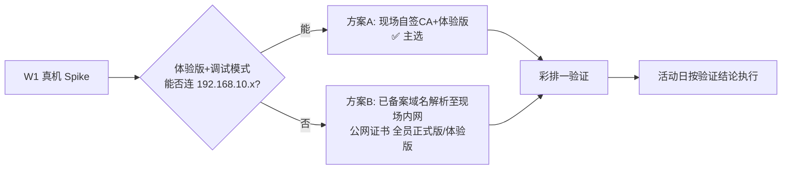

# 11 · 风险管理与应急预案

> 文档版本 v1.0　|　风险 = 概率(1低–5高) × 影响(1低–5高)；≥12 分必须专项缓解；所有风险指定 Owner（A=后端 / B=端与现场 / 共同）
> 关联：08-Runbook（故障处置）、07-彩排（验证手段）

---

## 1. 风险登记册

| ID | 风险 | 类别 | 概率 | 影响 | 分 | Owner | 缓解措施 | 应急回退 |
|---|---|---|---|---|---|---|---|---|
| R-01 | **小程序正式版无法连现场内网**（合法域名校验须备案 HTTPS，内网自签被拒） | 合规 | 4 | 5 | **20** | B | ①W1 真机 spike 验证「体验版+调试模式」；②准备已备案域名+证书方案 B；③活动日以体验版运行（已是成熟做法） | 体验版全员使用；管理员后台加入体验成员 |
| R-02 | **现场 Wi-Fi 覆盖不足**（5,000 人密集 + 障碍物） | 网络 | 3 | 4 | **12** | B | 彩排走点实测 RSSI；AP 高位架设、信道错开 1/6/11；顾客引导优先用蜂窝访问公网入口（若方案 B） | 增派移动路由；关键岗位员工终端切蜂窝 |
| R-03 | **GNSS 室内漂移误伤**（围栏拦住真实到场顾客） | 业务 | 3 | 3 | 9 | B | 阈值 800m 彩排校准；失败 3 次引导重试；白名单兜底 | 入口员工人工登记放行（半离线通道） |
| R-04 | **打印机高频故障/卡纸**（最高频现场故障） | 硬件 | 4 | 3 | **12** | B | 3 台含热备；员工「手动补打」；纸卷 60 卷冗余；彩排实测连续 200 张 | 手写单号模式（08-RB-01） |
| R-05 | **BE 宕机致小票停打** | 软件 | 2 | 4 | 8 | A | WAL+重发设计业务无感；systemd 自拉起；监控 backlog 告警 | RB-01 手写模式；恢复后补投补打 |
| R-06 | **2FA 密钥被逆向**（小程序包提取 K_CLI） | 安全 | 2 | 3 | 6 | A | 密钥每场更换；混淆拆片；伪造码仍需 openid 才有效；全量审计 | 接受残余风险（3–5h 窗口期）；异常领取人工核身份 |
| R-07 | **时钟失步致 2FA 大面积被拒** | 软件 | 2 | 4 | 8 | A | NTP 三源 + 客户端 10min 周期校时 + 页面校时状态灯 | 一键重校时；小票/订单号人工核销兜底 |
| R-08 | **CPE 出口断且备用失效** | 网络 | 2 | 2 | 4 | B | 核心交易全内网不受影响；双运营商 SIM | 仅影响 NTP/远程支撑；活动时长内漂移可容忍 |
| R-09 | **2 人团队关键成员生病/不可用** | 人员 | 2 | 5 | **10** | 共同 | ①文档完备（本套文档即单人可恢复）；②W8 留 2 天机动；③培训 1 名志愿者后备运维 | 志愿者按 Runbook 执行；关键操作双录屏教学 |
| R-10 | **压测不达标（SQLite/锁竞争）** | 性能 | 2 | 4 | 8 | A | W6 专周压测；分桶锁 + 批量写已预留；瓶颈时降级方案：库存快照批量 flush | 限流降速（客户端下单按钮 2s 冷却） |
| R-11 | **人流超预期（>5k）** | 业务 | 2 | 3 | 6 | 共同 | 容量按 5k 上限 50% 余量设计；限购收紧开关（2→1） | ADMIN 收紧限购 + 分时段入场广播 |
| R-12 | **商品售罄引发排队骚动** | 运营 | 3 | 2 | 6 | 共同 | 库存 ≤5 提前广播；售罄置灰清晰 | 机动员工疏导；纪念品发放区错峰 |
| R-13 | **数据丢失（未备份先断电）** | 数据 | 1 | 5 | 5 | A | WAL fsync + UPS 30min + 每 30min VACUUM INTO；U 盘双介质 | UPS 内完成备份；WAL 重放恢复 |
| R-14 | **员工误操作（错发/重复发放）** | 人为 | 3 | 2 | 6 | B | 角色权限最小化；强提示（红字/弹窗）；发放需二次确认 | 台账可查（谁发的），现场协调补偿 |
| R-15 | **审核未过（活动临近）** | 合规 | 2 | 3 | 6 | B | W5 前提交审核；活动类目+说明准备充分 | 全员切体验版（R-01 同款回退） |

## 2. 高危风险专项预案（分 ≥12 展开）

### R-01 专项：小程序联网合规双方案



- 方案 B 落地件：提前购买备案域名（F3）+ 证书（Let's Encrypt DNS 校验）+ 小程序后台登记合法域名；
- 无论哪个方案，**W1 结束必须出真机验证结论**（这是全项目最大不确定点，最先消灭）。

### R-02 专项：网络覆盖

- 彩排一输出「覆盖热力图」（每 5m 网格采样 RSSI）；
- AP 摆位三原则：高位（≥2.5m）、居中覆盖动线、避免金属遮挡；
- 员工 SSID（SH-Staff）与顾客 SSID（SH-Guest）隔离；员工终端绑定 5GHz 优先。

### R-04 专项：打印连续性

- 彩排二要求配货位连续打印 ≥200 张无故障；
- 现场每工位贴「换纸 3 步图」；备用机 10min 内可顶上（C3 放指挥台就近）。

### R-09 专项：单点人力

- 所有 Runbook 操作录制 ≤3min 短视频存本地（配文字版）；
- 志愿者 1 名在 W7 跟随彩排学习基础运维（重启服务/换打印机/登记本模式）。

## 3. 活动日分级应急响应

| 级别 | 定义 | 指挥 | 响应 |
|---|---|---|---|
| L1 轻微 | 单点小故障，≤2min 恢复 | 岗位员工自行处理 | Runbook 对应条目 |
| L2 一般 | 单区受影响 ≤10min（如打印机/AP） | 指挥台 | 启用备件 + 对讲机协调 |
| L3 严重 | 全场核心功能受影响（下单不可用/数据风险） | 指挥台 + 双开发 | ①广播切换人工模式 ②按 RB 处置 ③数据保护优先 |
| L4 灾难 | 系统整体不可恢复 | 筹委会 | 全人工义卖模式（预案：纸质登记 + 收款码 + 事后补录）；系统数据以 WAL/备份恢复做事后对账 |

> **总原则：业务连续 > 系统正确 > 数据完备**。任何情况下不让顾客排队空等超过 10 分钟——先人工放行，系统事后对账。

## 4. 保险与兜底清单（活动日随身/就位）

```
指挥台：备用 CPE、备用打印机、备用 SIM、U 盘 ×2、登记本 ×3、对讲机、打印版 Runbook
运维包：测线仪、工具包、网线 4 根、充电宝 ×2、胶带扎带
数据面：活动全程 F1 WAL 持续落盘（最坏情况也能补出全部订单）
```

## 5. 复盘要求（活动后 7 天内）

1. 数据对账报告：订单数/金额/纪念品发放/差异清单；
2. 事故记录：L2 以上事件按「时间线-根因-改进」三段式归档；
3. 经验沉淀：本文档集修订 v1.1（下届复用）；
4. 设备销账：归还登记 + 密钥销毁确认。
