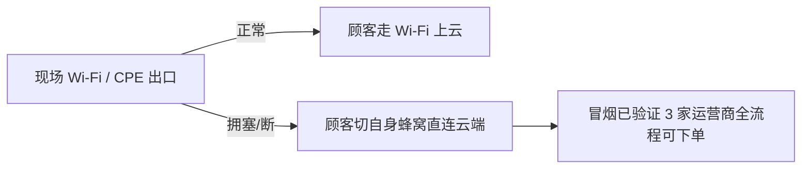

# 11 · 风险管理与应急预案

> 文档版本 v1.1　|　v1.1：云上公网部署后重评——R-01 消除，新增 R-16~R-19；SIM 已办理
> 风险 = 概率(1低–5高) × 影响(1低–5高)；≥12 分必须专项缓解；Owner：A=后端 / B=端与现场 / 共同

---

## 1. 风险登记册

| ID | 风险 | 类别 | 概率 | 影响 | 分 | Owner | 缓解措施 | 应急回退 |
|---|---|---|---|---|---|---|---|---|
| R-01 | ~~小程序无法连现场内网（域名校验）~~ | 合规 | — | — | **已消除** | B | 云上公网部署 + 备案域名 + HTTPS，合法域名校验天然满足 | 体验版兜底保留 |
| R-19 | **备案周期延误**（1–3 周不可控） | 合规 | 2 | 5 | **10** | B | W1 立即提交备案；进度每周核对 | 临时切换已备案主体域名；或港区节点（免备案，延迟略高） |
| R-16 | **现场出口拥塞**（CPE 上行被 5k 人挤占） | 网络 | 3 | 4 | **12** | B | CDN 卸载图片后出口仅 API（<5Mbps）；顾客 SSID 限速；**顾客可蜂窝直连**；双 CPE 异网 | 全员蜂窝直连（冒烟验证三家运营商） |
| R-04 | **打印机高频故障/卡纸** | 硬件 | 4 | 3 | **12** | B | 3 台含热备；手动补打；纸卷 60 卷；彩排实测连续 200 张 | 手写单号模式（08-RB-01） |
| R-09 | **2 人团队关键成员不可用** | 人员 | 2 | 5 | **10** | 共同 | 文档完备；W8 机动 2 天；培训 1 名志愿者 | 志愿者按 Runbook 执行 |
| R-18 | **云账号/公网安全**（密钥泄露、暴露面扩大） | 安全 | 2 | 4 | 8 | A | 安全组仅 443；SSH 密钥+IP 白名单；内部令牌每场轮换；限流+DDoS 基础防护（必要时 WAF） | 紧急轮换密钥/令牌；云控制台封禁 |
| R-17 | **CDN 缓存不一致**（改图/改价不生效） | 网络 | 2 | 3 | 6 | B | 图片 URL 版本化（?v=hash）；/api/* 不缓存；管理台一键刷新 | RB-08 手动刷新/直连源站 |
| R-02 | 现场 Wi-Fi 覆盖不足 | 网络 | 3 | 2 | 6 | B | 彩排走点实测；AP 高位错开信道；顾客蜂窝兜底 | 关键岗位切蜂窝 |
| R-03 | GNSS 室内漂移误伤真实顾客 | 业务 | 3 | 3 | 9 | B | 阈值 800m 彩排校准；失败引导；白名单 | 入口人工登记放行 |
| R-05 | BE 宕机致小票停打 | 软件 | 2 | 4 | 8 | A | WAL+重发业务无感；systemd 自拉起；backlog 告警 | RB-01 手写模式；恢复补打 |
| R-06 | 2FA 密钥被逆向 | 安全 | 2 | 3 | 6 | A | 密钥每场更换+混淆；伪造码仍需 openid；全量审计 | 接受窗口期敞口；异常人工核身份 |
| R-07 | 时钟失步致 2FA 大面积被拒 | 软件 | 2 | 4 | 8 | A | NTP 三源+10min 周期校时+状态灯；公网校时蜂窝可达 | 一键重校时；订单号人工核销 |
| R-10 | 压测不达标（锁竞争） | 性能 | 2 | 4 | 8 | A | W6 专周压测；分桶锁+批量写；云上可临时升配 | 客户端下单 2s 冷却降速 |
| R-11 | 人流超预期（>5k） | 业务 | 2 | 3 | 6 | 共同 | 容量 50% 余量；限购收紧开关 | 收紧限购+分时段入场广播 |
| R-12 | 商品售罄引发排队骚动 | 运营 | 3 | 2 | 6 | 共同 | 库存 ≤5 提前广播；售罄置灰 | 机动员工疏导；纪念品错峰 |
| R-13 | 数据丢失（未备份先断电） | 数据 | 1 | 5 | 5 | A | WAL fsync + 云盘快照 + 每 30min VACUUM INTO + 三介质 | 云快照/WAL 重放恢复 |
| R-14 | 员工误操作（错发/重复发放） | 人为 | 3 | 2 | 6 | B | 角色最小授权；强提示+二次确认；台账可查 | 现场协调补偿 |
| R-20 | 云服务商区域故障（罕见） | 云 | 1 | 4 | 4 | A | 数据三介质离线副本；单二进制可快速迁机 | 备 ECS 镜像 30min 重建 |
| R-21 | **前端聚合单机整机故障**（F1+F2 同机，交易+浏览同时停） | 云 | 1 | 4 | 4 | A | 双进程隔离降进程级故障面；CDN 边缘缓存兜底已加载页面；云镜像+数据盘 3min 重建；WAL 保证订单零丢失 | BE 独立保留账本；重建后 WAL/快照恢复 |
| R-15 | 小程序审核未过（临近活动） | 合规 | 2 | 3 | 6 | B | W5 前提交审核；材料齐全 | 全员体验版（正式版障碍已小） |

## 2. 高危风险专项预案（分 ≥10 展开）

### R-16 专项：现场出口拥塞 → 蜂窝直连兜底



- CDN 卸载后出口只需承载 API（<5Mbps）；顾客 SSID 限速 2Mbps/终端防挤占；
- 彩排必测：关 Wi-Fi 用移动/联通/电信各 1 台真机全流程下单；
- 员工终端 Wi-Fi 不通即切蜂窝（云端公网可达，零配置切换）。

### R-19 专项：备案周期

- W1 提交备案（域名 + 主体材料），每周核对进度；
- 兜底 A：挂学校已备案主体增域名解析（最快）；兜底 B：港区节点免备案（延迟 +20~40ms，交易可接受）；
- 无论哪条路径，**W5 前必须锁定可用公网域名**并完成小程序合法域名登记。

### R-04 专项：打印连续性

- 彩排二要求配货位连续打印 ≥200 张无故障；每工位贴换纸 3 步图；备用机 10min 内顶上。

### R-09 专项：单点人力

- Runbook 全部操作录制 ≤3min 短视频 + 文字版；志愿者 1 名 W7 随彩排学习基础运维。

## 3. 活动日分级应急响应

| 级别 | 定义 | 指挥 | 响应 |
|---|---|---|---|
| L1 轻微 | 单点小故障 ≤2min 恢复 | 岗位员工 | Runbook 对应条目 |
| L2 一般 | 单区受影响 ≤10min | 指挥台 | 启用备件 + 对讲机协调 |
| L3 严重 | 全场核心功能受影响（云服务/出口不可用） | 指挥台 + 双开发 | ①广播切蜂窝/人工模式 ②按 RB 处置 ③数据保护优先 |
| L4 灾难 | 云端整体不可用且短期无法恢复 | 筹委会 | 全人工义卖模式（纸质登记+收款码+事后补录）；数据以云快照/WAL 恢复做事后对账 |

> **总原则：业务连续 > 系统正确 > 数据完备**。顾客侧兜底优先级：现场 Wi-Fi → 自身蜂窝 → 登记本人工模式。

## 4. 保险与兜底清单（活动日随身/就位）

```
指挥台：备用 CPE、备用打印机、U 盘 ×2、登记本 ×3、对讲机、打印版 Runbook
运维包：测线仪、工具包、网线 4 根、充电宝 ×2、胶带扎带
数据面：F1 WAL 持续落盘 + 云盘快照（最坏情况也能补出全部订单）
链路面：三家运营商蜂窝直连云端已验证（不依赖任何现场网络设施）
```

## 5. 复盘要求（活动后 7 天内）

1. 数据对账报告：订单数/金额/纪念品发放/差异清单；
2. 事故记录：L2 以上事件按「时间线-根因-改进」三段式归档；
3. 云资源处置确认：ECS 快照→释放/降配、CDN 停用、密钥销毁；
4. 经验沉淀：本文档集修订 v1.2（下届复用）；
5. 设备销账：归还登记确认。
